# AVMS - Ajaya Venture Management System

Multi-venture business management system for Ajaya Ventures. Run all your
businesses — Mushroom, Fish Farming, Agriculture, Poultry, Dairy and more —
from one centralized application.

## Screenshots

### Dashboard — live KPIs, low-stock alerts, recent activity

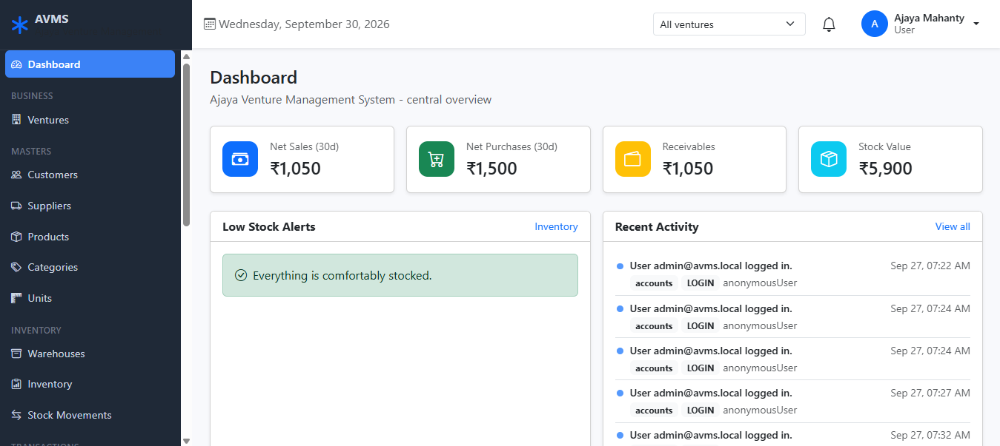

### Masters — ventures, customers, suppliers, products, categories, units

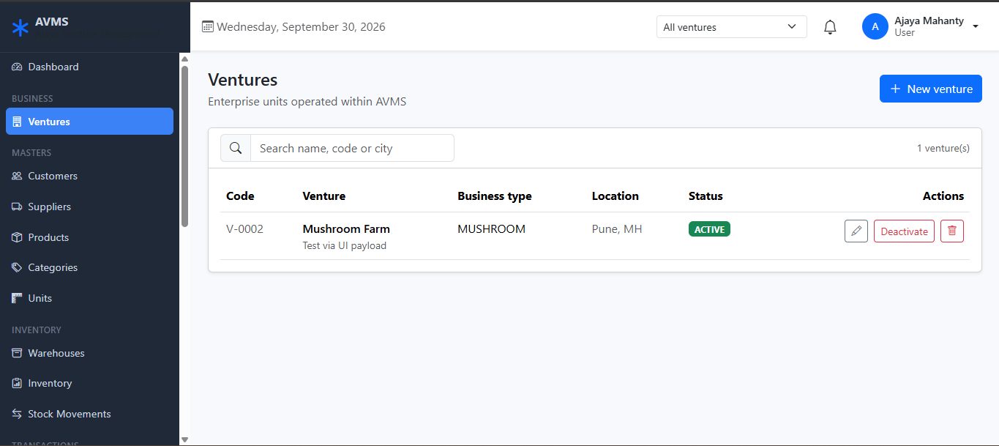
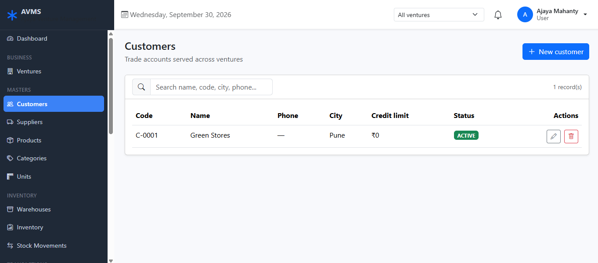
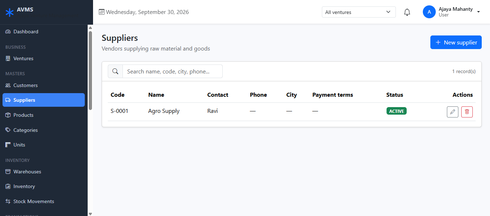
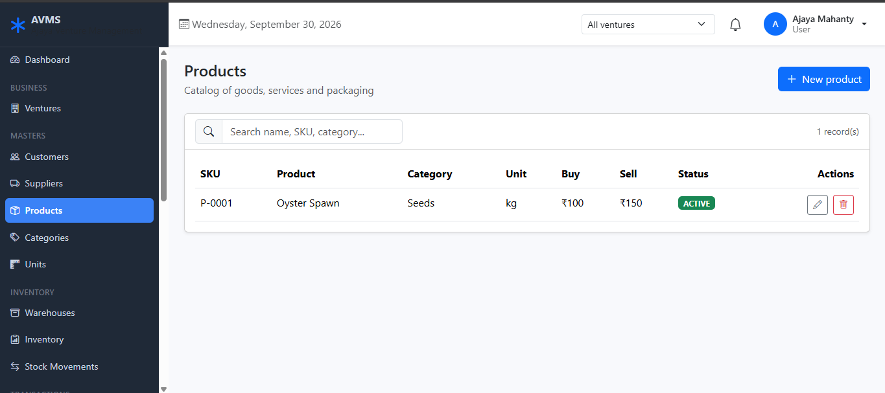
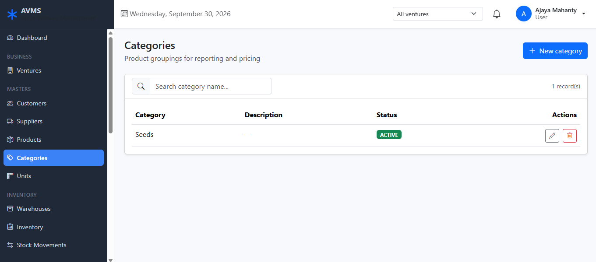
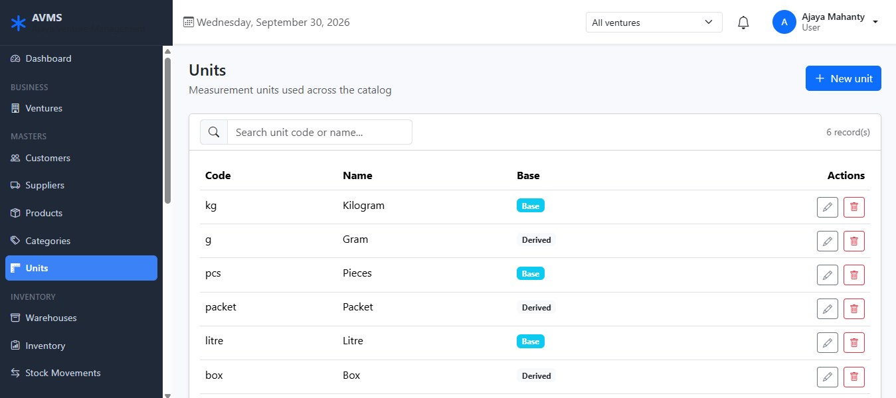

### Inventory — warehouses, live stock, stock movements

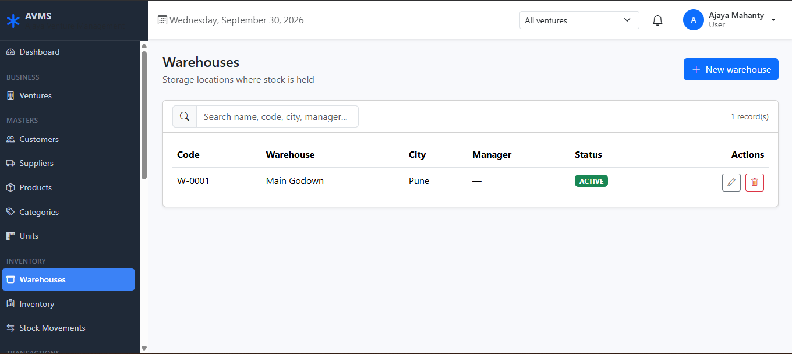
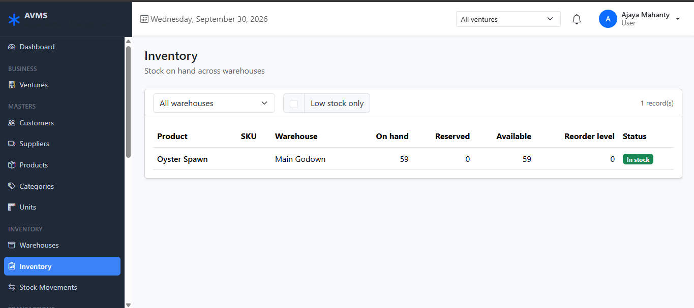
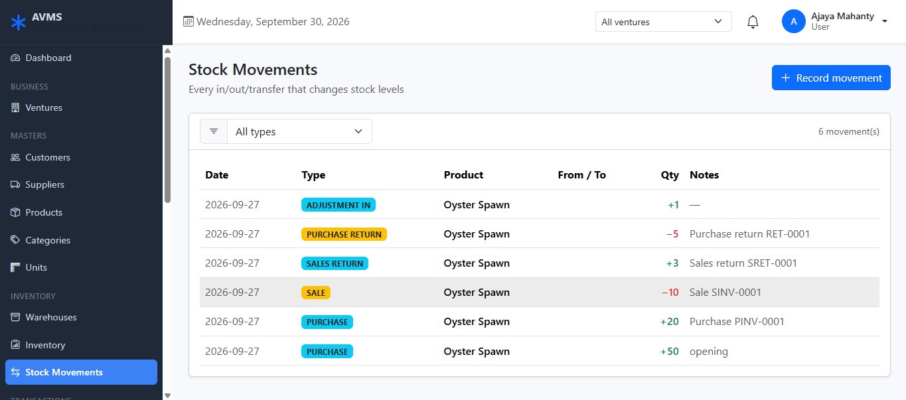

### Reports — sales, purchases, inventory and financial reports

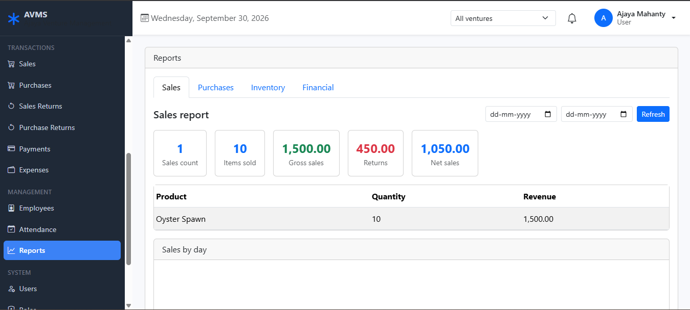

## Features

| Area          | What you can do                                                                 |
| ------------- | ------------------------------------------------------------------------------- |
| Dashboard     | Live KPIs (net sales, net purchases, receivables, stock value), low-stock alerts, recent activity, backend status |
| Ventures      | Create and manage business units with auto codes (`V-0001`), activate/deactivate |
| Masters       | Customers (`C-####`), suppliers (`S-####`), products (`P-####` SKUs), categories, units |
| Inventory     | Warehouses (`W-####`), live stock (on hand / reserved / available), stock movements, transfers, low-stock filter |
| Purchases     | Purchase bills (`PINV-####`) with item lines, auto totals, purchase returns (`RET-####`) |
| Sales         | Sale bills (`SINV-####`) with item lines, auto totals, sales returns (`SRET-####`) |
| Payments      | Record money received/paid against bills (capped at outstanding), one-click reversal |
| Expenses      | Category-wise operating expenses with filters and totals                        |
| Employees     | Employee records (`EMP-####`), self-service and bulk attendance, monthly summary |
| Reports       | Sales, purchases, inventory/valuation and financial reports (revenue, COGS, margin, profit, receivables, cash flow) |
| Notifications | Inbox with unread badge; auto alerts for sales, purchases, payments, low stock  |
| Audit Logs    | Filterable trail of every create/update/delete and login event                  |
| Users & Roles | Email-based login (JWT), six seeded roles, per-module view/manage permissions   |

## Technology Stack

| Layer    | Technology                                         |
| -------- | -------------------------------------------------- |
| Frontend | React 19, Vite, Bootstrap 5, React Router, Axios   |
| Backend  | Java 17, Spring Boot 3.4 (Web, Data JPA, Security) |
| Database | Oracle 21c (Flyway-managed migrations V1–V7)       |
| Auth     | JWT access tokens + rotating refresh tokens        |
| API Docs | Swagger UI at `/api/docs.html`                     |

## Project Structure

```text
AVMS/
├── backend-java/            # Spring Boot REST API
├── frontend/                # React single-page app
├── tests/jmeter/            # smoke-test plan (used by CI)
├── docker-compose.yml       # Oracle XE + backend + frontend
├── Jenkinsfile              # CI pipeline
└── docs/                    # architecture and mapping notes
```

---

## Part 1 - Download the project

**Prerequisites:** Git, Java 17+, Maven 3.9+, Node.js 20+, Oracle 21c.

```bash
git clone <your-repo-url>
cd AJAYA-VENTURES
```

---

## Part 2 - Set up the environment

### 2.1. Database (run once)

Create the application user inside your pluggable database (example below
uses `orclpdb`; with Docker it is `XEPDB1`). Connect as SYSDBA and run:

```sql
ALTER SESSION SET CONTAINER = orclpdb;
CREATE USER avms IDENTIFIED BY avms;
GRANT CONNECT, RESOURCE TO avms;
ALTER USER avms QUOTA UNLIMITED ON USERS;
```

Tables, seed data (roles, units, expense categories) are created
automatically by Flyway the first time the backend starts.

### 2.2. Backend environment

```bash
cd backend-java
cp .env.example .env        # Windows: copy .env.example .env
```

Open `.env` and check these values (defaults work for local Oracle):

| Variable             | Example value                          | Purpose                              |
| -------------------- | -------------------------------------- | ------------------------------------ |
| `DB_URL`             | `jdbc:oracle:thin:@localhost:1521/orclpdb` | Oracle JDBC URL (match your PDB name) |
| `DB_USER`            | `avms`                                 | Database user from step 2.1          |
| `DB_PASSWORD`        | `avms`                                 | Database password                    |
| `JWT_SECRET`         | any 32+ character string               | Signs login tokens (change in prod)  |
| `JWT_ACCESS_MINUTES` | `30`                                   | Access-token lifetime                |
| `JWT_REFRESH_DAYS`   | `7`                                    | Refresh-token lifetime               |
| `CORS_ORIGINS`       | `http://localhost:5173,http://localhost:5174` | Frontend URLs allowed to call the API |
| `SPRING_PROFILES_ACTIVE` | `dev`                              | `dev` (local Oracle) / `test` (H2, for tests) |

> The backend always starts with `-Duser.timezone=UTC` so date handling
> matches the database (see step 3.1).

### 2.3. Frontend environment

```bash
cd frontend
npm install                            # first time only
cp .env.example .env                   # Windows: copy .env.example .env
```

`.env` contains one value:

| Variable       | Example value                  | Purpose                          |
| -------------- | ------------------------------ | -------------------------------- |
| `VITE_API_URL` | `http://localhost:8081/api`    | Backend API base URL             |

---

## Part 3 - Run the application

### 3.1. Start the backend

```bash
cd backend-java
mvn -B package -DskipTests                # builds target/avms-backend-*.jar (first time)
```

```bash
# Windows CMD (reads the .env values you set above)
set SPRING_PROFILES_ACTIVE=dev
set DB_URL=jdbc:oracle:thin:@localhost:1521/orclpdb
set DB_USER=avms
set DB_PASSWORD=avms
java -Duser.timezone=UTC -jar target/avms-backend-0.1.0.jar --server.port=8081
```

Backend runs at **http://localhost:8081** (API under `/api/`).

### 3.2. Start the frontend (new terminal)

```bash
cd frontend
npm run dev
```

Frontend runs at **http://localhost:5174** (or 5173 if free).

### 3.3. Verify

```bash
curl http://localhost:8081/api/health/
# {"success":true,"data":{"status":"ok","service":"avms-backend",...}}
```

Browse Swagger UI at http://localhost:8081/api/docs.html.

### 3.4. First login

1. Open the frontend URL and go to **Login**.
2. Sign in with your administrator account.
3. Open **Users** to create employee logins and **Roles** to grant
   per-module (`*.view` / `*.manage`) permissions.

> Forgot your password? Use **Forgot password** on the login page; the
> reset link is shown on screen (no mail server needed locally).

### 3.5. Run with Docker (alternative)

```bash
docker compose up
```

Starts Oracle XE + backend (port 8080) + frontend (port 5173) with the
default `avms/avms` database user.

---

## Part 4 - How to use it (daily workflow)

1. **Pick a venture** in the top bar — all screens filter to it automatically.
2. **Masters first:** add Units (pre-seeded: kg, g, pcs, packet, litre, box),
   Categories, Products, Customers, Suppliers and a Warehouse.
3. **Opening stock:** record a `PURCHASE`/`ADJUSTMENT_IN` movement (or create
   a Purchase bill — stock posts automatically).
4. **Buy:** create a Purchase bill with item lines → totals, balances and
   stock update themselves. Returns reverse stock via Purchase Returns.
5. **Sell:** create a Sale bill the same way (stock is checked — overselling
   is rejected). Record customer money in **Payments** (capped at the due
   amount); supplier dues are settled the same way.
6. **Spend & staff:** log Expenses by category; maintain Employees and mark
   Attendance (staff can mark their own).
7. **Review:** Dashboard KPIs, the four Reports, Notifications bell and
   Audit Logs show everything that happened.

Every create/update/delete saves to the database immediately and refreshes
that screen in place — no page reload needed; dropdowns elsewhere pick up
new entries when opened.

---

## Part 5 - Tests & troubleshooting

```bash
cd backend-java
mvn -B verify        # 20 tests + 60% coverage gate, H2 in-memory DB
cd ../frontend
npm run lint && npm run build
```

| Problem | Fix |
| ------- | --- |
| Backend exits with `Port 8081 was already in use` | Stop the old process or use `--server.port=8082` (and point `VITE_API_URL` at it) |
| `ORA-12514` / login failure at startup | `DB_URL` PDB name must match your database (`orclpdb`, `XEPDB1`, …) |
| `ORA-01017` | Wrong `DB_USER`/`DB_PASSWORD`; recreate the user per step 2.1 |
| Login page error `Authentication required` | Backend unreachable — check it is running and `VITE_API_URL` matches its port |
| Dates look shifted | Always start the jar with `-Duser.timezone=UTC` |

## License

Proprietary - internal use.
